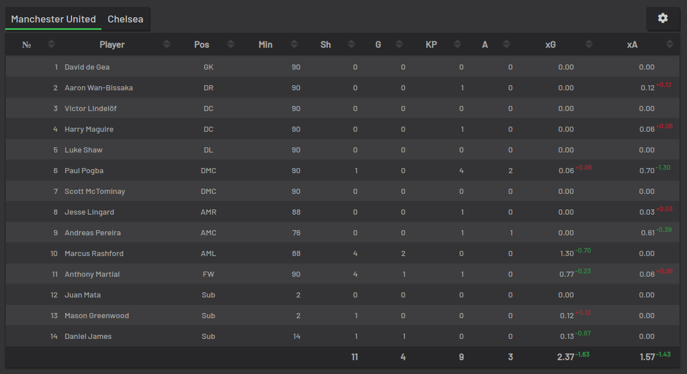

# football-data-extraction
- Extracts football data from certain data sources
- The raw JSON data is pulled via the **understat** module created by [Amos Bastian](https://github.com/amosbastian)
- Extracts various kinds of football data from the top 5 leagues, starting from the 2014/15 season.
- The top 5 leagues are: `['EPL', 'Bundesliga', 'La Liga', 'Serie A', 'Ligue 1']`

## Usage
- You'll have to first install Python 3.6 (or higher) via any of these links:
    1) [Python 3.7 for Windows 10](https://www.youtube.com/watch?v=gV-yluunPjI)
    2) [Python 3.8 for Windows 10/8/7](https://www.youtube.com/watch?v=O5nHFBhCfFo)
    3) [Python for Mac OS](https://www.youtube.com/watch?v=TgA4ObrowRg)
    4) [Python 3.6 for Mac OS](https://www.youtube.com/watch?v=uA8SA81nivg)
- Make sure your environment variables are setup correctly - search for another resource on how to install Python, if necessary.
- Open command-line/terminal in `football-data-extraction` directory, and do `pip install -r requirements.txt` to install all dependencies. If you're unfamiliar with command-line for Windows, check [this](https://www.youtube.com/watch?v=MBBWVgE0ewk&list=PL6gx4Cwl9DGDV6SnbINlVUd0o2xT4JbMu) out.
- You might have to regenerate IDs of players/teams every season, by running any one of the following commands inside the `understat_wrangler` directory:
    1) `python3 regenerate_ids.py`
    2) `python regenerate_ids.py`
    3) `py regenerate_ids.py`
- Open the `user_inputs.csv` file in the `understat_wrangler` directory, and feed in your inputs, regarding which data you'd like to extract.
- You can then pull wrangled stats from [understat](https://understat.com/) by running any one of the following commands inside the `understat_wrangler` directory:
    1) `python3 run.py`
    2) `python run.py`
    3) `py run.py`

## Code structure
- The source code is present in the `understat_wrangler` directory
- The `extract.py` file is used to extract raw JSON data from the [understat module](https://github.com/amosbastian/understat). You can checkout the [understat documentation](https://understat.readthedocs.io/en/latest/) as well.
- The `transform.py` file is used to transform/wrangle the raw JSON data into human-readable Excel/CSV files.
- The `pipeline.py` file is used to put together the code in the codebase, and store various Excel/CSV files, as desired.

## Which data can be extracted?
- On [this page by Amos Bastian](https://understat.readthedocs.io/en/latest/classes/understat.html#the-functions), you can see which data is being extracted.
- I've displayed the information that I reckon is necessary from said page below

### Upcoming league fixtures data

### League players data

### League results data

### Match players data (data about all players in a given match)

### Match shots data (data about all shots taken in a given match)

### Player grouped stats data

### Player shots data

### Player stats data

### Stats data (Time-series of stats)

### Upcoming team fixtures data

### Team players data

### Team results data

### Team stats data

### Team data (by league/season)

## Contributing and Collaborating
- Feel free to make a pull request with details about what you intend to change/add.
- Feel free to write up an issue if you'd like to communicate any issues or reach out to me.